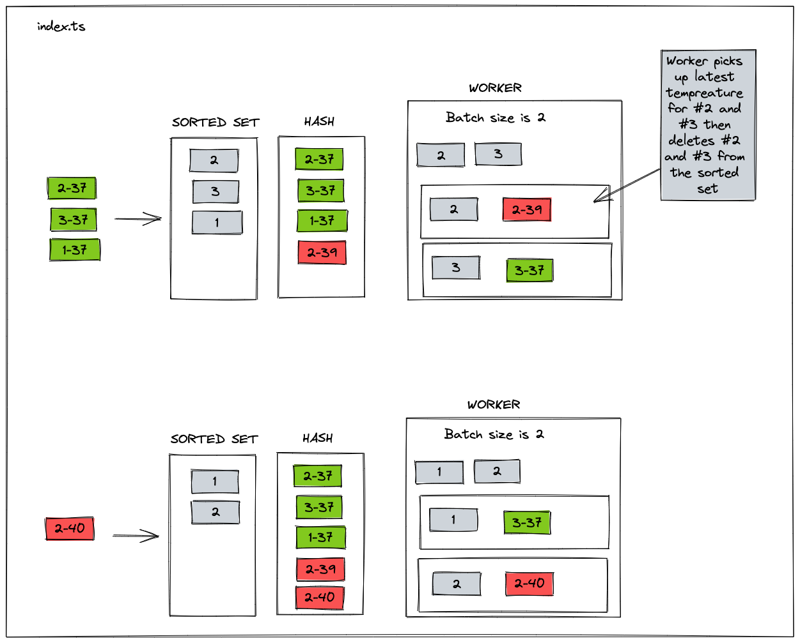
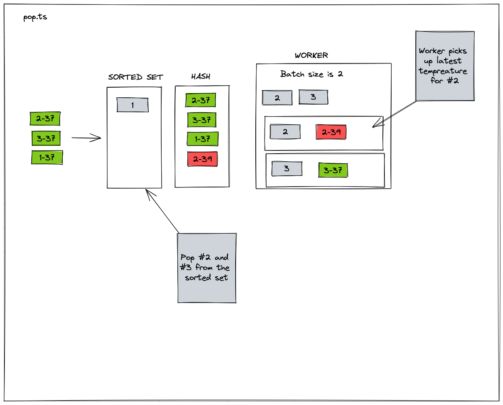

# Patient Temperature Updater

This is an example of updating patient temperatures in micro-batches.

Patient entries are kept in the order they are received, but the data is for the latest temperature reading.

So when the entry is _pulled_ it will contain the latest temperature reading for the patient.

## Using Range



Get top X items from the sorted set. Loop over each item and delete from the sorted set and get the latest value

## Using Pop



Pop X items from the sorted set. Loop over each item get the latest value.

## Setup

```bash
pnpm install
docker-compose up -d
pnpm start
```
